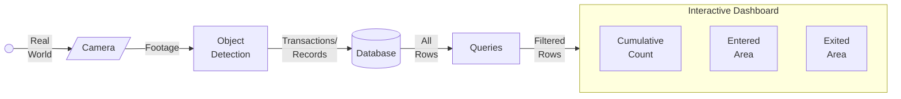

# Human Counting using Deep Learning

## Problem Statement

Crowd counting is a method for counting or estimating how many individuals are present in pictures/videos. Estimating the crowd accurately is a difficult but important undertaking that has been used in various contexts, such as urban planning, public safety, surveillance, microbiology, population estimating, item counting, and traffic flow monitoring.

Deep Learning (DL) is a subset of machine learning. It works using a neural network of 3/more layers. It mimics the human brain’s behavior allowing it to ‘learn’ from large amounts of data. DL is used in the domain of digital image processing to solve difficult problems (e.g. image colourization, classification, segmentation and detection). With the help of enormous data and plenty of computing power, DL techniques like Convolutional Neural Networks (CNNs) have largely improved prediction performance and pushed the limits of what is feasible.

The goal of this project is to develop a real-time current and cumulative human counting implementation using Deep Learning Object Detection, that provides better accuracy than current traditional methods, and implement this for events at Birla Institute of Technology & Science-Pilani, Dubai Campus (local issue).

## Flowchart

## Expected Outcome

Administrator can view results from a live dashboard, where it shows an accurate count of number of people who

- are currently present at an area
- entered an area
- exited an area

and also obtain useful insights from this data

## Major Applications

### Events

Events need to ensure that entered persons are registered. This tool will help identify abnormalities, if the number of registrants is not equal to the number of physical entries.

eg: Jashn, BSF

### Retail Stores

Retails stores need to ensure that max capacity is not reached; also, they can use this data for revenue optimization by applying data mining algorithms such as analyzing peak hours.

eg: Supermarkets, Grocery Stores, Malls